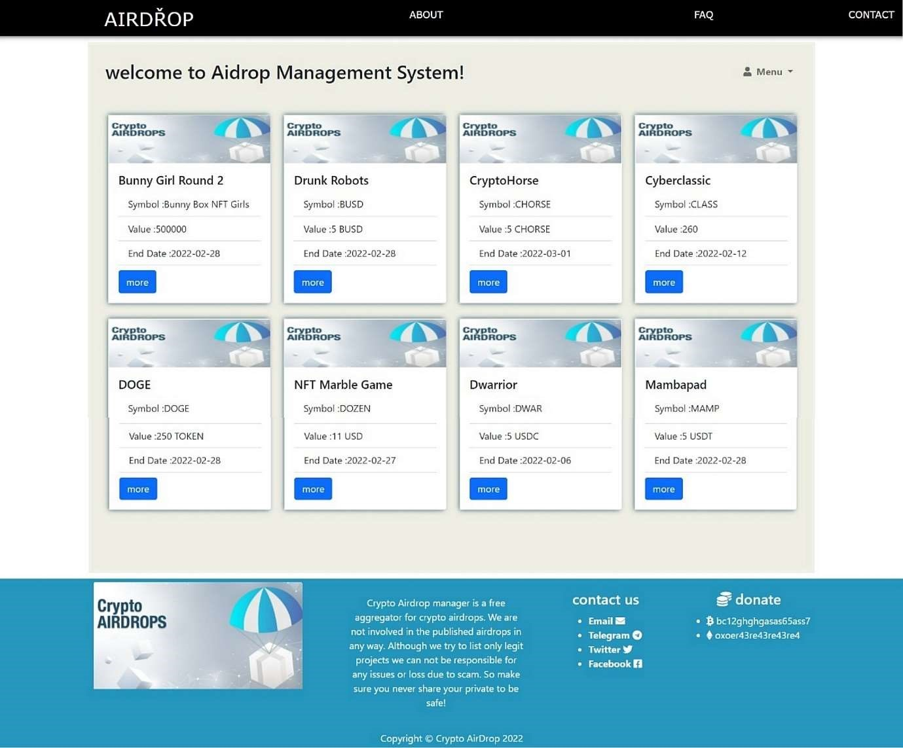
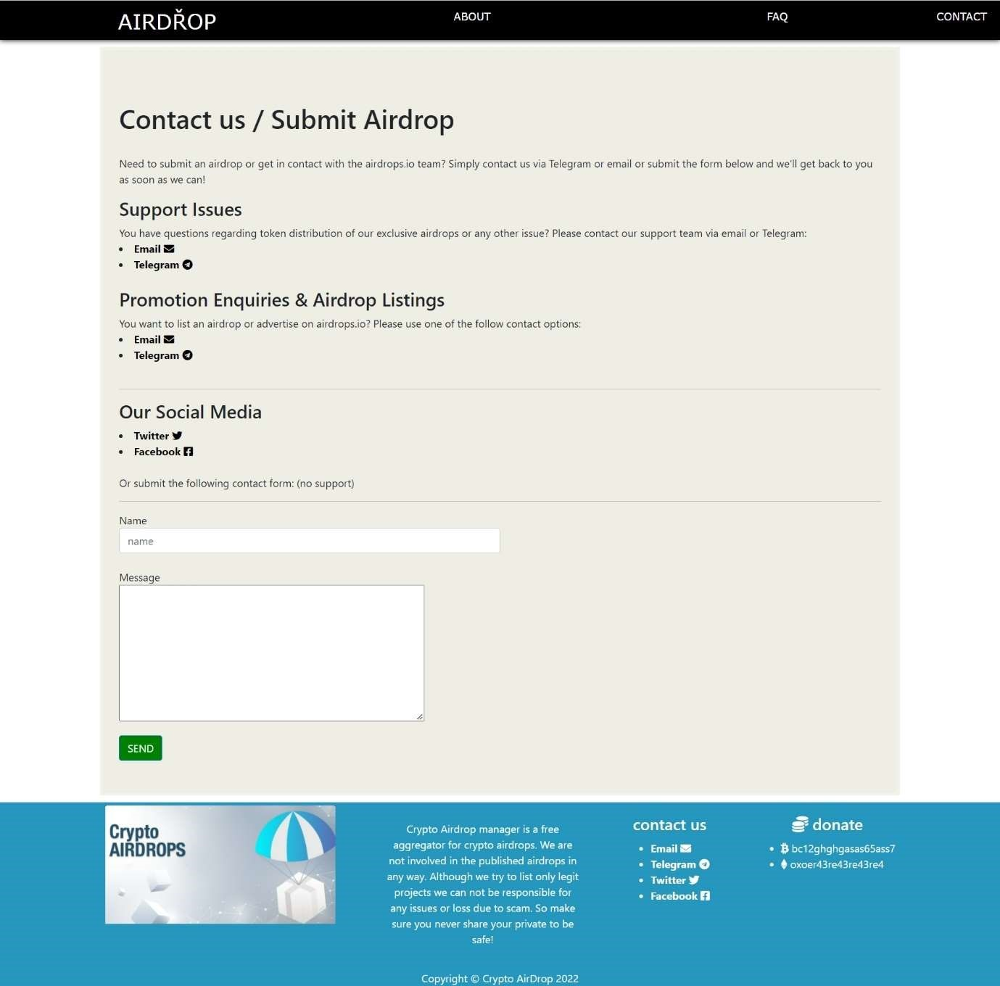
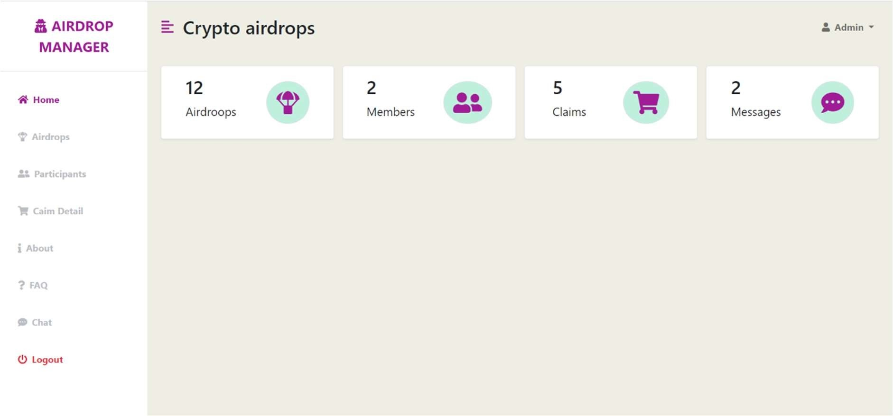
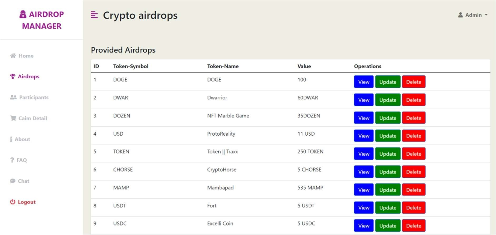
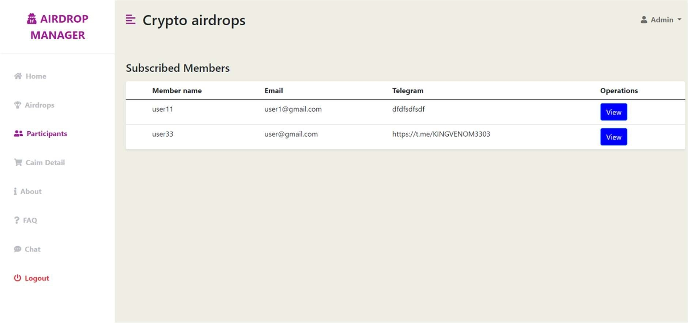

# Crypto-Airdrop-Management-System

The aim of this project is to distribute airdrop to all participants in a
single platform. The entire project standing on only one man who is admin.
We created admin who distribute airdrop which are provided by different
network community to participants along with basic knowledge about crypto
currencies.

 Crypto airdrop Management Project using PHP and MySQL is a web based
application. It is a dynamic system. It can be maintain and changed easily because
it is based on database. It’s contain web pages that are generated in real-time.
These pages include Web scripting code, such as PHP. It is fully secured from
unauthorized access. In a word it can say that our project is a completely dynamic
website 

<h3>Home Page </h3> 
 

<h3>Login Page</h3> 
 

<h3>Cantact Page</h3> 
 

<h3>Admin dashboard</h3> 
 

<h3>Airdrop Detail Page</h3> 
 

<h3>Participants Page</h3> 
 
